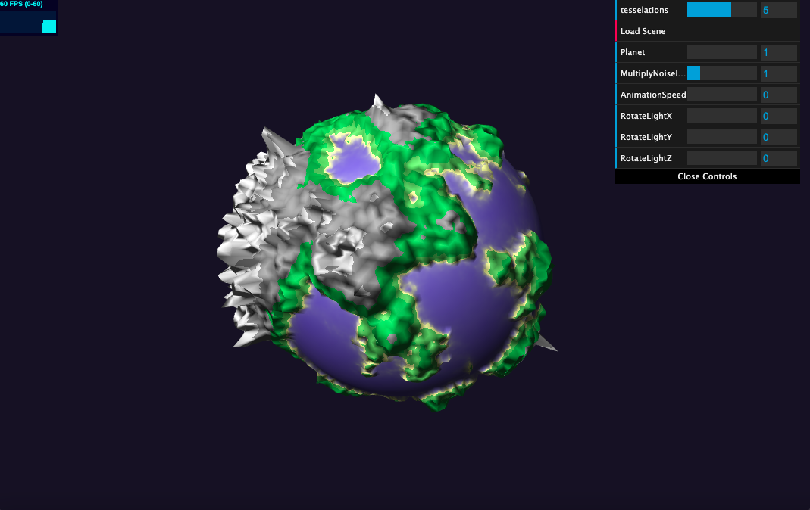
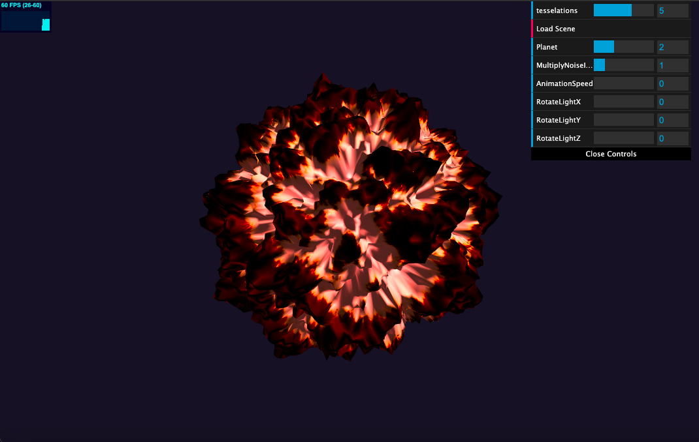
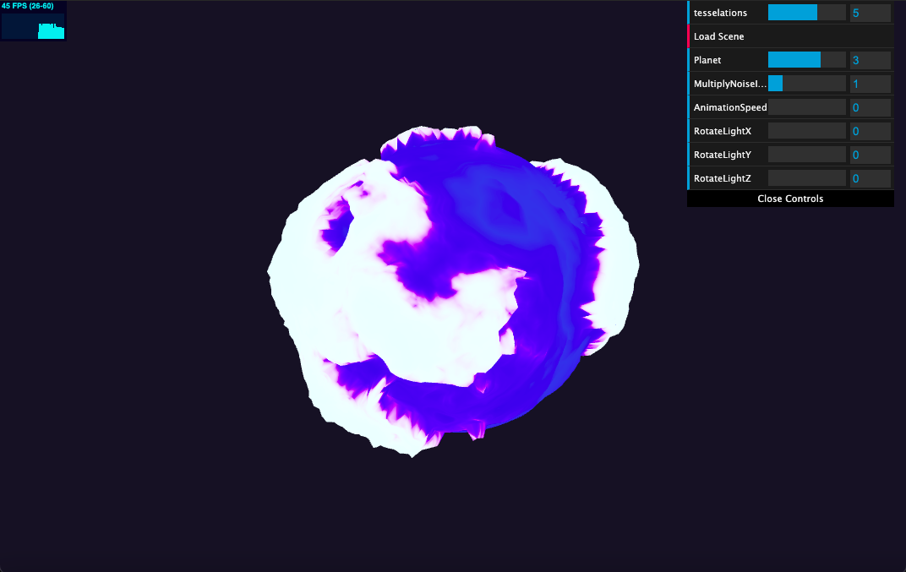
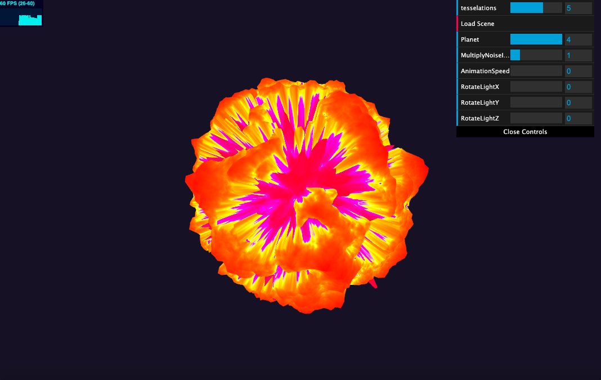

# CIS 566 Project 1: Noisy Planets

Name: Eddie Huang

PennKey: huanged

Earth:

Molten:

Ice:

Startburst:

Project Description:

The four biomes on the Earth are mountain, forest, beach, and ocean. The toolbox functions I used are sin/cos, bias, gain, and pulse. The GUI additions I made were a slider to change the planet, a slider to change the multiplier of the noise input, a slider to change the animation speed, and sliders to rotate the light source around if the planet has a shader model. 

Earth:

I used FBM to create the general terrain and then added in Perlin Noise to create the mountains and Worley Noise to add more texture to the forests/sand. In the fragment shader I clamped the colors for the different biomes based on FBM and also used gain and bias to help transition between the colors. I used Blinn-Phong shading for this planet.

Molten:

I used FBM with a higher scaled noise input to create the general terrain, and then spiked up the mountains by increasing the multiplier if a certain threshold was met and also decreased the multiplier and added animation if the noise value is below a certain threshold. I then fed in the same noise input into the fragment shader and used a cosine color palette to color in the terrain. I also used Blinn-Phong shading with a specular color that is tinted red to color the planet.

Ice:

I fed in FBM with some constant modifiers into Perlin Noise, and then multiplied that into the input to FBM once again to create the terrain. I also used a threshold to modify some constants in order to create the ocean. I then fed in the same noise input into the fragment shader and used a cosine color palette to color in the terrain. I did not use any shading on this planet.

Starburst:

I used FBM with some constant multipliers to create the general terrain and then to create the spikey inside I multiplied in Perlin Noise if a certain threshold was met. I then fed in the cosine of the time variable into a cubic pulse function to add animation. I once again used a cosine color palette add in the colors. I did not use any shading on this planet.

## Objective
- Continue practicing WebGL and Typescript
- Experiment with noise functions to procedurally generate the surface of a planet
- Review surface reflection models

## Base Code
You'll be using the same base code as in homework 0.

## Assignment Details
- Update the basic scene from your homework 0 implementation so that it renders
an icosphere once again. We recommend increasing the icosphere's subdivision
level to 6 so you have more vertices with which to work.
- Write a new GLSL shader program that incorporates various noise functions and
noise function permutations to offset the vertices on the surface of the icosphere and modify the color of the icosphere so that it looks like a planet with geographic
features. Your planet should have __at least four distinct "biomes"__ on its surface (they do not have to be Earth biomes). Try making formations like mountain ranges, oceans, rivers, lakes, canyons, volcanoes, ice caps, glaciers, or even forests. We recommend using 3D noise functions whenever possible so that you don't have UV distortion, though that effect may be desirable if you're trying to make the poles of your planet stand out more.
- Combined with your noise functions, use __at least four__ different functions from the Toolbox Functions slides. They should be used to either adjust your noise distribution, or animate elements on your planet's surface.
- Implement __at least two__ surface reflection model (e.g. Lambertian, Blinn-Phong,
Matcap/Lit Sphere, Raytraced Specular Reflection) besides on the planet's surface to
better distinguish the different formations (and perhaps even biomes) on the
surface of your planet. Make sure your planet has a "day" side and a "night"
side; you could even place small illuminated areas on the night side to
represent cities lit up at night.
- Add GUI elements via dat.GUI that allow the user to modify different
attributes of your planet. This can be as simple as changing the relative
location of the sun to as complex as redistributing biomes based on overall
planet temperature. You should have __at least three modifiable attributes__.
- Have fun experimenting with different features on your planet. If you want,
you can even try making multiple planets! Your score on this assignment is in
part dependent on how interesting you make your planet, so try to
experiment with as much as you can!

Here are some examples of procedural planets:
- [Pixel Planet](https://deep-fold.itch.io/pixel-planet-generator)
- [Earthlike Planet](https://www.reddit.com/r/proceduralgeneration/comments/fqk56t/animation_procedural_planet_composition/)
- [Topographic Field](https://www.shadertoy.com/view/llscW7)
- [Dan's Final Project](https://vimeo.com/216265946)

## Useful Links
- [Implicit Procedural Planet Generation](https://static1.squarespace.com/static/58a1bc3c3e00be6bfe6c228c/t/58a4d25146c3c4233fb15cc2/1487196929690/ImplicitProceduralPlanetGeneration-Report.pdf)
- [Curl Noise](https://petewerner.blogspot.com/2015/02/intro-to-curl-noise.html)
- [GPU Gems Chapter on Perlin Noise](http://developer.download.nvidia.com/books/HTML/gpugems/gpugems_ch05.html)
- [Worley Noise Implementations](https://thebookofshaders.com/12/)

## Submission
Commit and push to Github, then __make a pull request on the original Github repository__. Assignments will no longer be submitted on Canvas.

For this assignment, and for all future assignments, modify this README file
so that it contains the following information:
- Your name and PennKey
- Citation of any external resources you found helpful when implementing this
assignment.
- A link to your live github.io demo
- At least one screenshot of your planet
- An explanation of the techniques you used to generate your planet features.
Please be as detailed as you can; not only will this help you explain your work
to recruiters, but it helps us understand your project when we grade it!

## Extra Credit
Any or All of the following bonus items:
- Use a 4D noise function to modify the terrain over time, where time is the
fourth dimension that is updated each frame. A 3D function will work, too, but
the change in noise will look more "directional" than if you use 4D.
- Use music to animate aspects of your planet's terrain (e.g. mountain height,
  brightness of emissive areas, water levels, etc.)
- Create a background for your planet using a raytraced sky box that includes
things like the sun, stars, or even nebulae.
- Add a textured moon that orbits your planet
