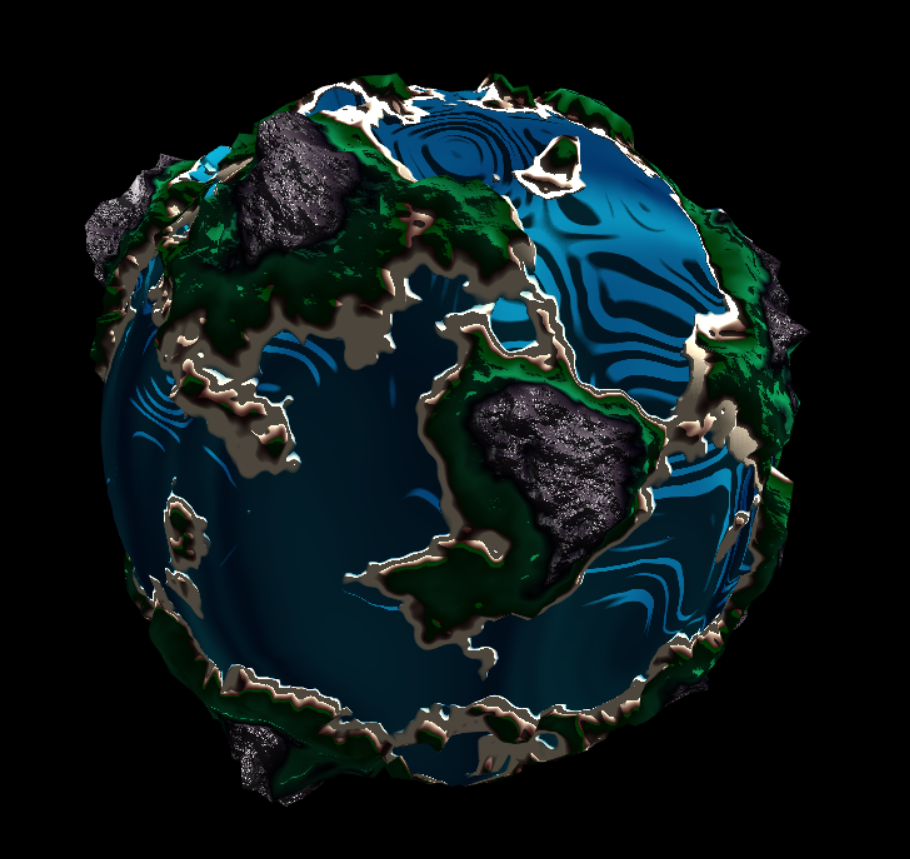

# CIS 566 Project 1: Noisy Planets
Name : Samantha Lee
PennKey : smlee18

Sources: https://gist.github.com/patriciogonzalezvivo/670c22f3966e662d2f83 

Live Demo: https://18smlee.github.io/hw00-webgl-intro/

## Biomes
There are four different types of terrain: ocean, beach, forest, and mountains. The elevation of a given vertex is based on a fractional brownian noise function from the above source. The lighter noise values correspond to higher elevation and the darker noise values correspond to lower elevation. 

I then applied gain and bias functions to certain ranges that transition between different biome thresholds. This was to give the slope of the mountains and beaches a more curved look, rather than just being extruded straight up from the surface of the sphere. 

The water has a warped noise function applied to it to give it an unconvential marbled look. The vertices are also slightly raised with the moving water to emulate slow moving waves.

The land biome has a couple of different noise functions applied to it. There is one to soften the look of the land by interpolating a darker green into a lighter green. There is also a forestNoise value that affects both the color and the vertices. This noise function is made to simulate vegetation or forests scattered across the planet. I created the forest noise function with an fbm function with a lower frequency and a perlin noise function with a higher frequency and interpolated between the two. This gave an interesting output with more variation between sizes of random "blobs", more closely mimicking natural vegetaion. The user can control the density of the forest with the forest density parameter.

The mountain biome has its own mountainNoise fbm function to further its surface and color to mimick natural rock formations. 

## Color Palette and Terrain Frequency
I created two color palettes: earth and alien. The earth color palette creates a planet most resembling earth, with green forests, blue water, and grey mountains. The alien color palette however has a more foreign look with orange beaches, purple vegetation, and violet mountains. The final color palette is an interpolation between these two palettes, with the interpolation value being controlled by the user. So the user can decide how earthlike or alienlike they want their planet to be!

The terrain frequency can also be controled by the user. This is a frequency value that is multiplied by the noise input of the original noise function that determines the elevation of a point. Giving control of the terrain's variation to the user allows them to create differently shaped planets in the blink of an eye!

## Shading
I've applied lambert shading to the entire planet with a slowly rotating light. There is blinn phong shading on just the mountains to accentuate their jagged formations.  
