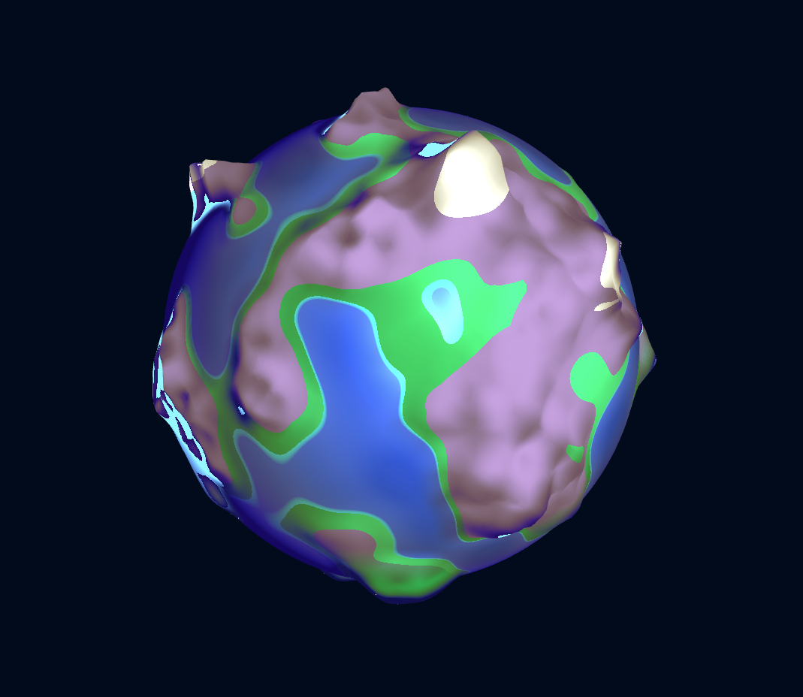
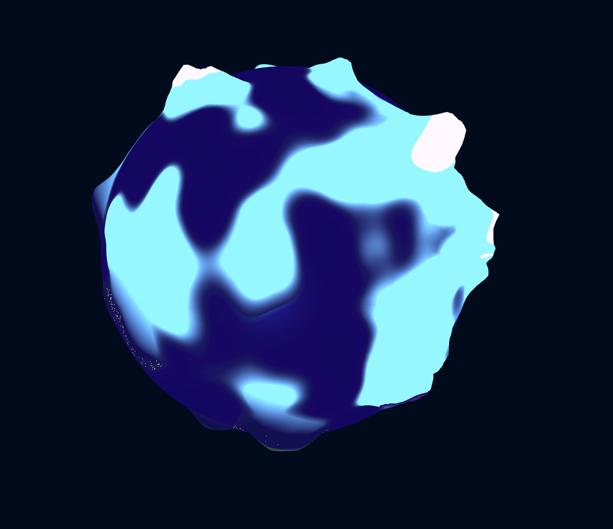
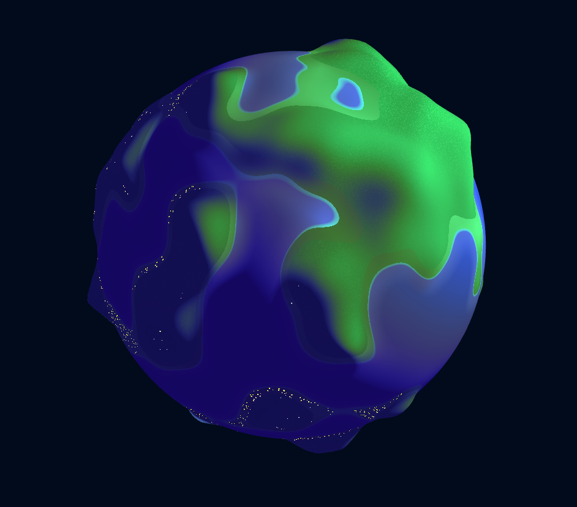
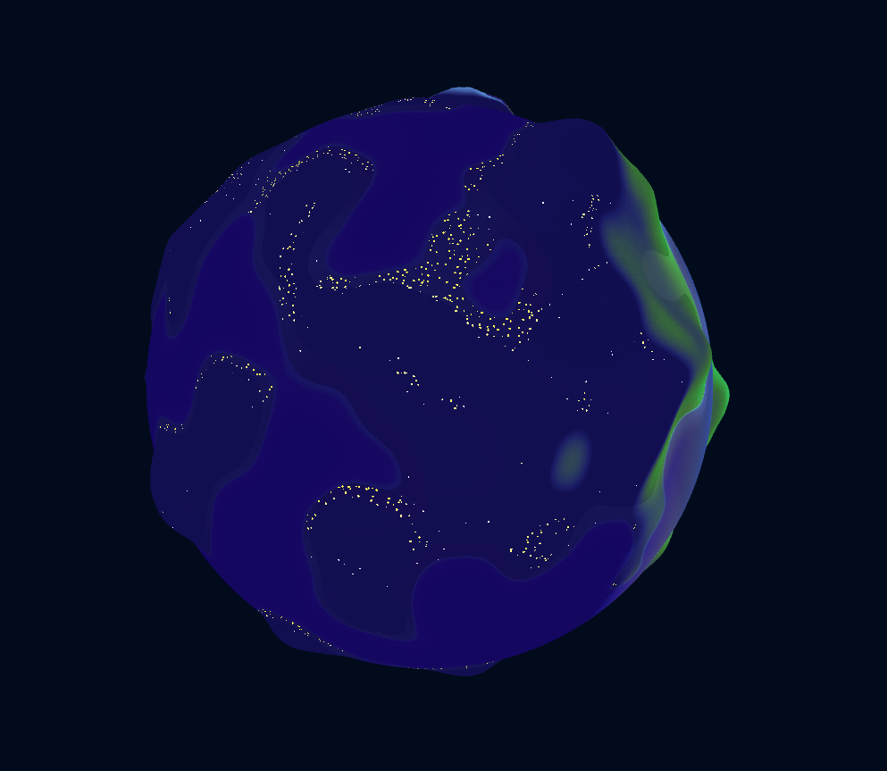
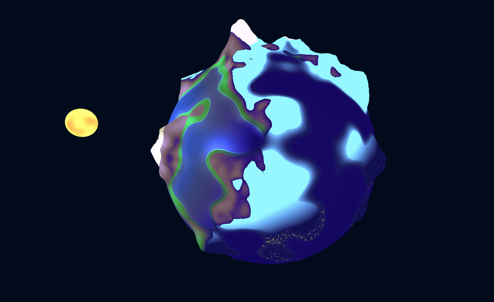
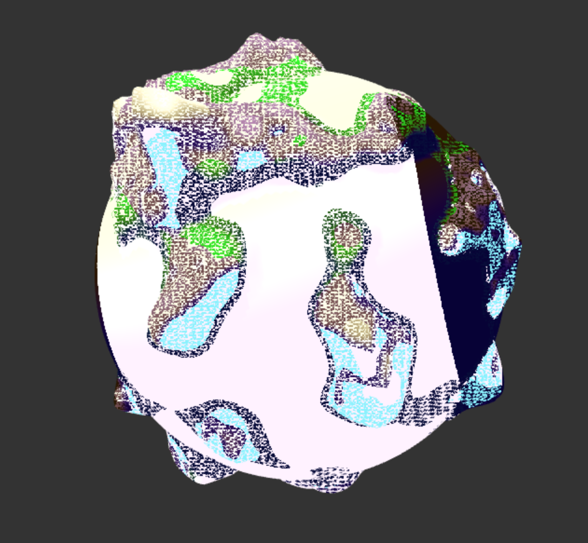

# CIS 566 Project 1: Noisy Planets

**Author: Ashley Alexander-Lee**

### Description
This project involved generating a procedural planet with WebGL and Typescript using noise and transition functions. A live demo can be found at https://asalexan.github.io/hw01-noisy-planet/ . If you wish to try it out locally, you can simply clone the repository, run `npm i` to install dependencies, and type `npm start` to run it on a local host.

### Usage
- Click and drag to rotate the camera around the planet
- Scroll to zoom in and out
- To change the light position, move the x, y, z sliders in the righthand controls
- To change the city density along the coast, move the `City Density` slider
- To lessen the glow from the mountains, move the `% Mountain Glow` slider
- To increase or decrease the planet tesselations, move the slider at the top
- You can toggle the sun on or off as desired

### Features
#### Mountain Biome
I created a mountain biome using Worley noise, and heights above a certain threshold become snow. 

During the night cycle, I ignore the lambertian term to allow the mountains to appear to "glow". I wanted it to seem as if the mountains were emitting light, so the grass below the mountains interpolates from the luminescent color to the lambertian color based on how close to the mountain the point is. 

#### Hill Biome
The hills are a product of distorted perlin noise, which interpolates into either the ocean or mountains depending on the height and hemisphere. 

At night, when the light is facing away from the biome, there are cities distributed based on the similarity of the original sphere normal and the height field normal. The more similar the normals are, the denser the cities become (you will notice the cities are the densest on the coastline). The user has the ability to change the density of lights on the coastline with a slider. 

The lights themselves are created with worley noise, and the density is controlled by the grid size. If a point is below a certain max distance from a cell center, it becomes a light. This 'max distance' is the scale of the lights, which has to be interpolated along with the grid size. 

#### The Sun
The user can toggle the sun on and off, and the light position determines where the sun appears. The light position is projected to the surface of the sphere, then offset by some radius, which represents the distance of the light from the planet. The light itself is interpolated over the hemisphere over a cosine color palette. This gives it the subtle impression of bleeding into sunset before night falls. 

#### Ocean Biome
The ocean is shallower as it gets closer to the shoreline, and this shallow portion is animated to lap against the land continuously. The ocean is created by a certain noise threshold -- the noise interpolates between this 0 height ocean and either hills or mountains. I use the blinn-phong reflectance model to give the ocean a bit of a sheen in reaction to light hitting it. 

### Bloopers (Features? Semantics)

#### Just Trying To Animate the Water But This Is Ok I Guess

#### This Was Definitely On Purpose

#### A Little Ambitious With Those Height Deformations...

