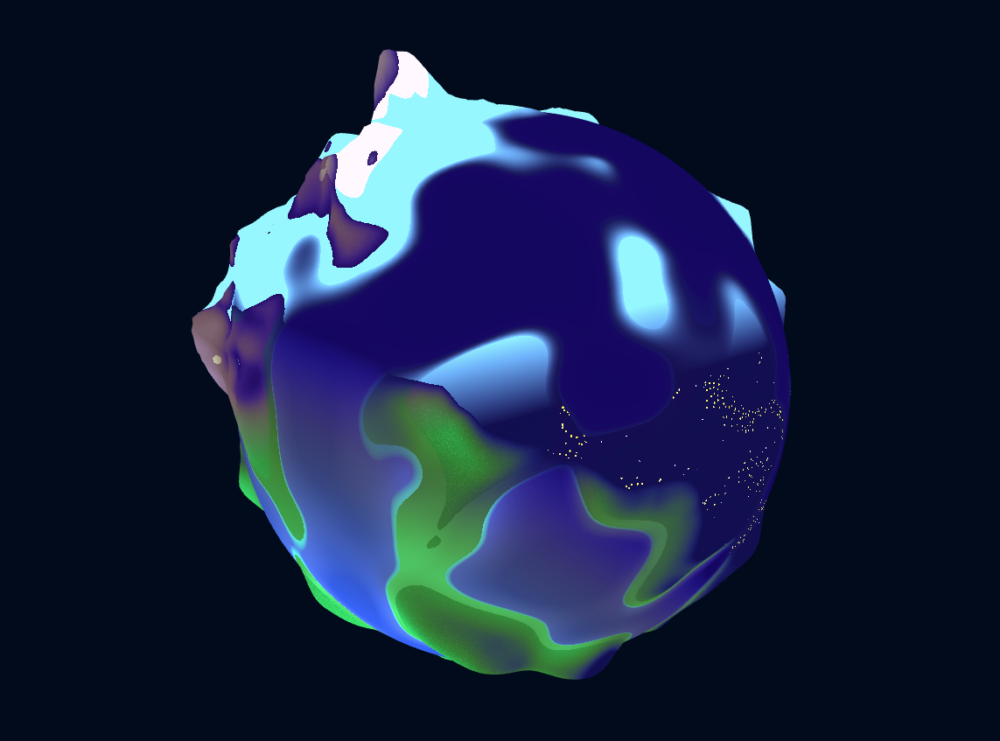
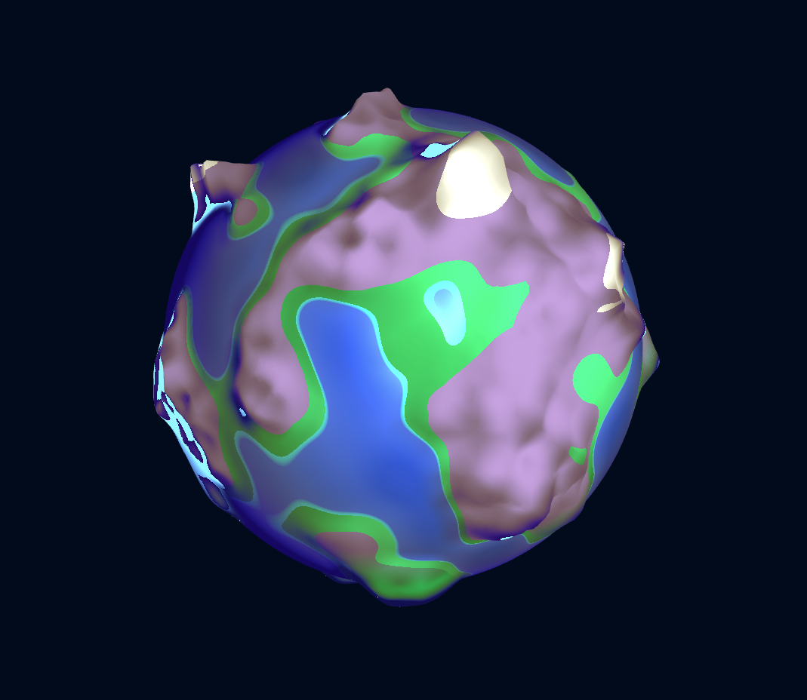
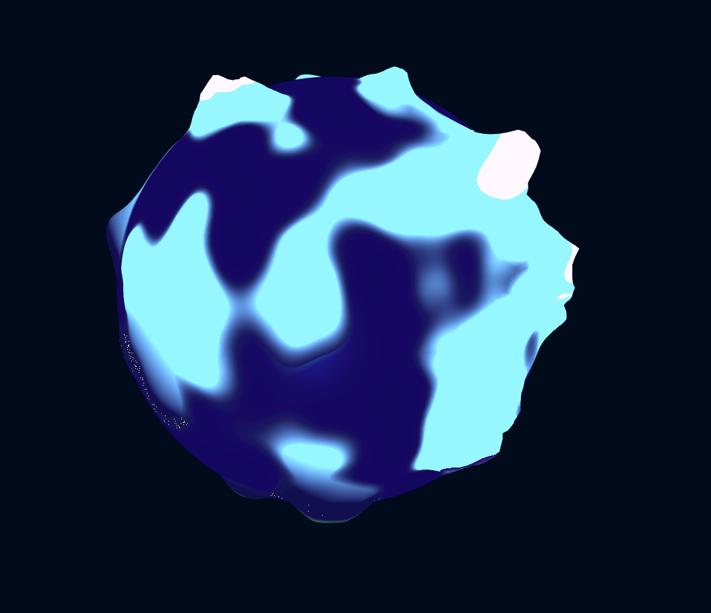
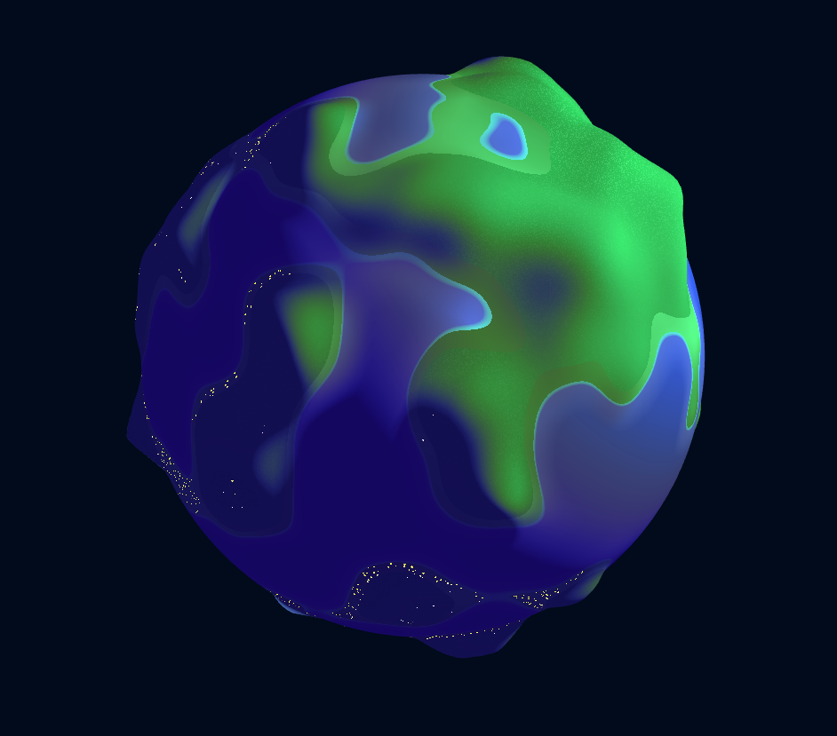
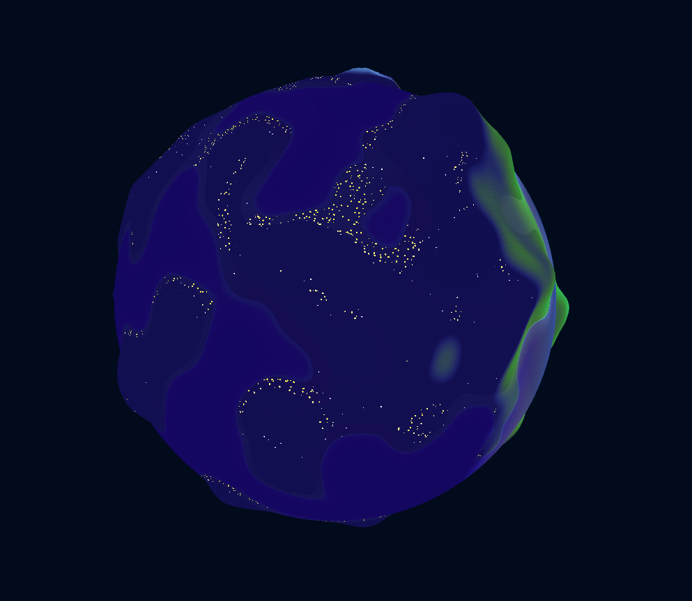
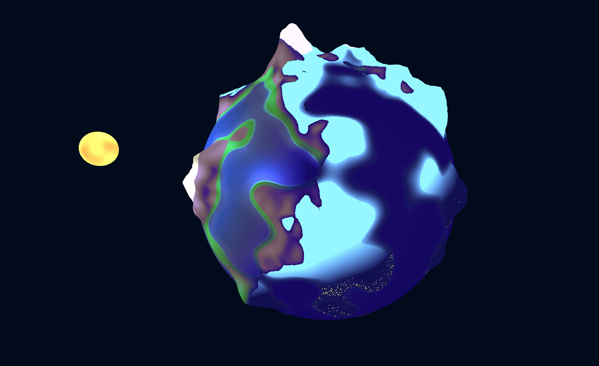
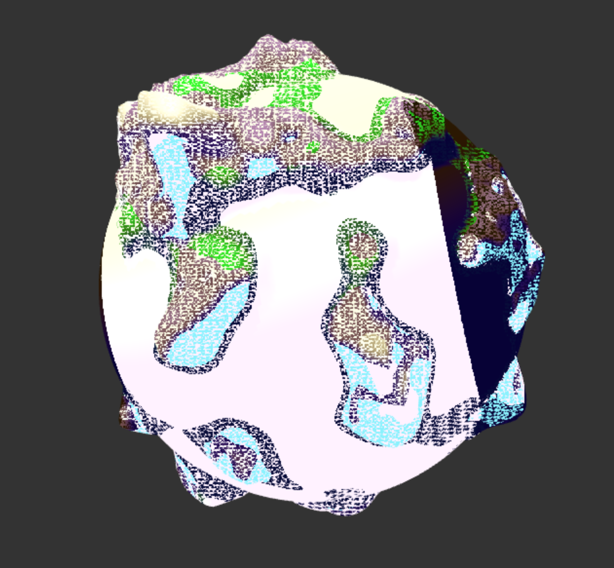
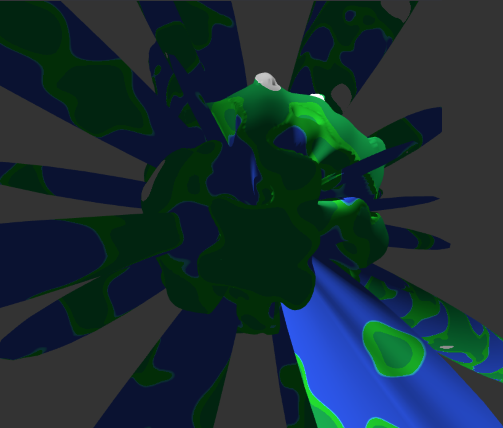

# CIS 566 Project 1: Noisy Planets

**Author: Ashley Alexander-Lee**

### Description
This project involved generating a procedural planet with WebGL and Typescript using noise and transition functions. A live demo can be found at: _______ . If you wish to try it out locally, you can simply clone the repository, run `npm i` to install dependencies, and type `npm start` to run it on a local host.

### Features
#### Mountain Biome
I created a mountain biome using Worley noise, and heights above a certain threshold become snow. 

During the night cycle, I ignore the lambertian term to allow the mountains to appear to "glow". I wanted it to seem as if the mountains were emitting light, so the grass below the mountains interpolates from the luminescent color to the lambertian color based on how close to the mountain the point is. 

#### Hill Biome

### Bloopers (Features? Semantics)

#### Just Trying To Animate the Water But This Is Ok I Guess

#### This Was Definitely On Purpose

#### A Little Ambitious With Those Height Deformations...

