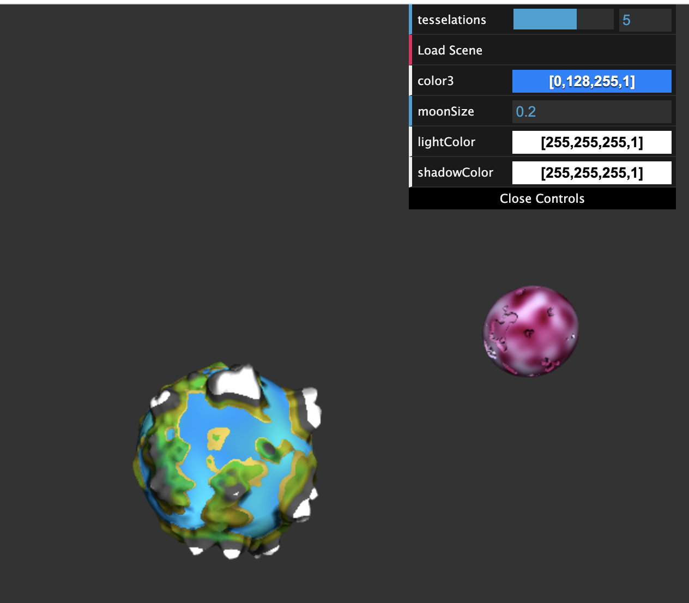
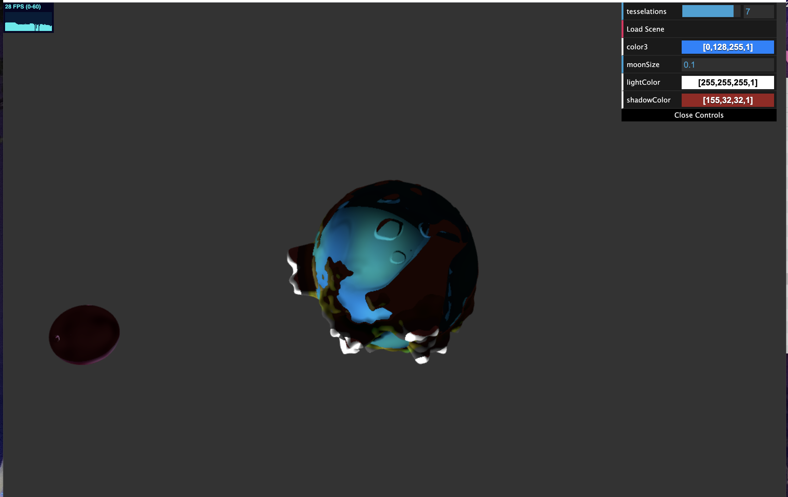

# CIS 566 Project 1: Noisy Planets

Emma Holthouser
PennKey Emma20

Resources Used
http://dev.thi.ng/gradients/ - for my cosine color palettes

https://www.shadertoy.com/view/ssXSzX https://www.shadertoy.com/view/sd2Gzd-my old shader toy shaders for noise functions

https://thebookofshaders.com/12/ -referenced books of shaders when tweaking my noise

I currently do not have a working link because my gh-pages is not updating. It only shows the original black square
https://emmaholthouser16.github.io/hw01-noisy-planet/

I created a stylized earth like planet with a purple moon. My planet has four different regions, an ocean region with islands, a hill region, a plateau region, and a moutian region. I used different forms of 3D perlin noise to create the plateau and island biomes, with the island biome biased toward the relatively flatness of the ocean, and different version of 3D fbm for the hills and moutains. I then bilinearly interpolated between the four biomes to get the height at each point on the planet. I used a 2D fbm funciton to interpolate between all of the values. The x of the 2D fbm was used to interpolate between the moutains / hills and then the ocean/ pleateau. The y of the fbm was then used to interpolate between the resulting two values. This resulted in having island mostly at the bottom of the planet and hills and moutains along the top and middle. I used the height of the point relative to the center of the sphere to determine the color of the point and break the biomes up by color. I did not blocks of color separating the hill and moutian biome so I interpolated between the hill color and th emoutain color in the areas in between. I also used an fbm based cosine color palette for the green color and a another fbm function for the base of a color cosine palette for the coean. The oean color also changes based off of a time variable. Most of the planet is using lambert shading but the snow capped moutains have blinn phong applied and the ocean is an iridescent shader that is being used as the color term for lambert shading so that shadows are still applied. I also created a small moon for my planet and used fbm for the creaters and perlin noise as the base of a purple cosine color palette for the color. The user can change the size of the moon and also change the color of not only the light but also the shadows. I think shadow color is a very important artistic aspect that is often overlooked. 
## Objective
- Continue practicing WebGL and Typescript
- Experiment with noise functions to procedurally generate the surface of a planet
- Review surface reflection models

## Base Code
You'll be using the same base code as in homework 0.

## Assignment Details
- Update the basic scene from your homework 0 implementation so that it renders
an icosphere once again. We recommend increasing the icosphere's subdivision
level to 6 so you have more vertices with which to work.
- Write a new GLSL shader program that incorporates various noise functions and
noise function permutations to offset the vertices on the surface of the icosphere and modify the color of the icosphere so that it looks like a planet with geographic
features. Your planet should have __at least four distinct "biomes"__ on its surface (they do not have to be Earth biomes). Try making formations like mountain ranges, oceans, rivers, lakes, canyons, volcanoes, ice caps, glaciers, or even forests. We recommend using 3D noise functions whenever possible so that you don't have UV distortion, though that effect may be desirable if you're trying to make the poles of your planet stand out more.
- Combined with your noise functions, use __at least four__ different functions from the Toolbox Functions slides. They should be used to either adjust your noise distribution, or animate elements on your planet's surface.
- Implement __at least two__ surface reflection model (e.g. Lambertian, Blinn-Phong,
Matcap/Lit Sphere, Raytraced Specular Reflection) besides on the planet's surface to
better distinguish the different formations (and perhaps even biomes) on the
surface of your planet. Make sure your planet has a "day" side and a "night"
side; you could even place small illuminated areas on the night side to
represent cities lit up at night.
- Add GUI elements via dat.GUI that allow the user to modify different
attributes of your planet. This can be as simple as changing the relative
location of the sun to as complex as redistributing biomes based on overall
planet temperature. You should have __at least three modifiable attributes__.
- Have fun experimenting with different features on your planet. If you want,
you can even try making multiple planets! Your score on this assignment is in
part dependent on how interesting you make your planet, so try to
experiment with as much as you can!

Here are some examples of procedural planets:
- [Pixel Planet](https://deep-fold.itch.io/pixel-planet-generator)
- [Earthlike Planet](https://www.reddit.com/r/proceduralgeneration/comments/fqk56t/animation_procedural_planet_composition/)
- [Topographic Field](https://www.shadertoy.com/view/llscW7)
- [Dan's Final Project](https://vimeo.com/216265946)

## Useful Links
- [Implicit Procedural Planet Generation](https://static1.squarespace.com/static/58a1bc3c3e00be6bfe6c228c/t/58a4d25146c3c4233fb15cc2/1487196929690/ImplicitProceduralPlanetGeneration-Report.pdf)
- [Curl Noise](https://petewerner.blogspot.com/2015/02/intro-to-curl-noise.html)
- [GPU Gems Chapter on Perlin Noise](http://developer.download.nvidia.com/books/HTML/gpugems/gpugems_ch05.html)
- [Worley Noise Implementations](https://thebookofshaders.com/12/)

## Submission
Commit and push to Github, then __make a pull request on the original Github repository__. Assignments will no longer be submitted on Canvas.

For this assignment, and for all future assignments, modify this README file
so that it contains the following information:
- Your name and PennKey
- Citation of any external resources you found helpful when implementing this
assignment.
- A link to your live github.io demo
- At least one screenshot of your planet
- An explanation of the techniques you used to generate your planet features.
Please be as detailed as you can; not only will this help you explain your work
to recruiters, but it helps us understand your project when we grade it!

## Extra Credit
Any or All of the following bonus items:
- Use a 4D noise function to modify the terrain over time, where time is the
fourth dimension that is updated each frame. A 3D function will work, too, but
the change in noise will look more "directional" than if you use 4D.
- Use music to animate aspects of your planet's terrain (e.g. mountain height,
  brightness of emissive areas, water levels, etc.)
- Create a background for your planet using a raytraced sky box that includes
things like the sun, stars, or even nebulae.
- Add a textured moon that orbits your planet
