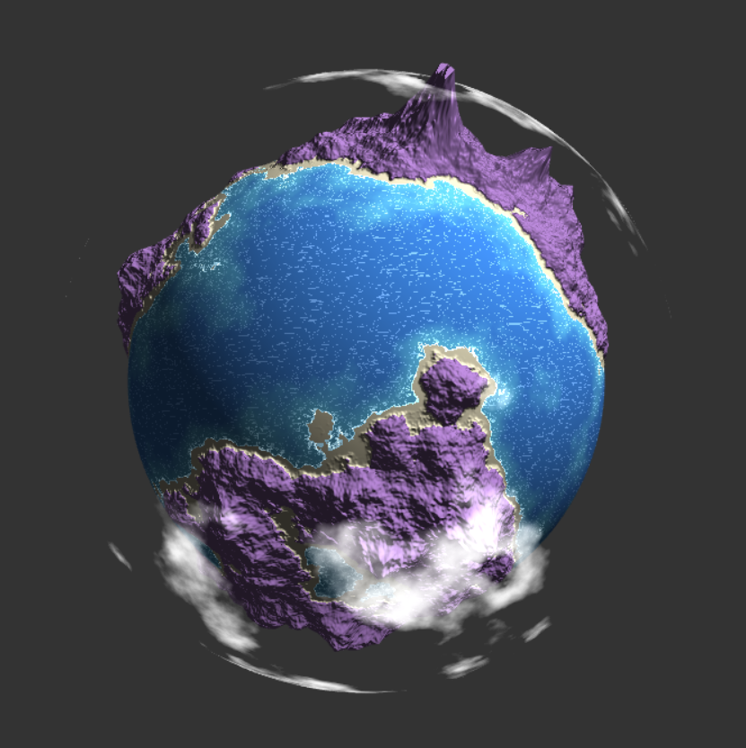
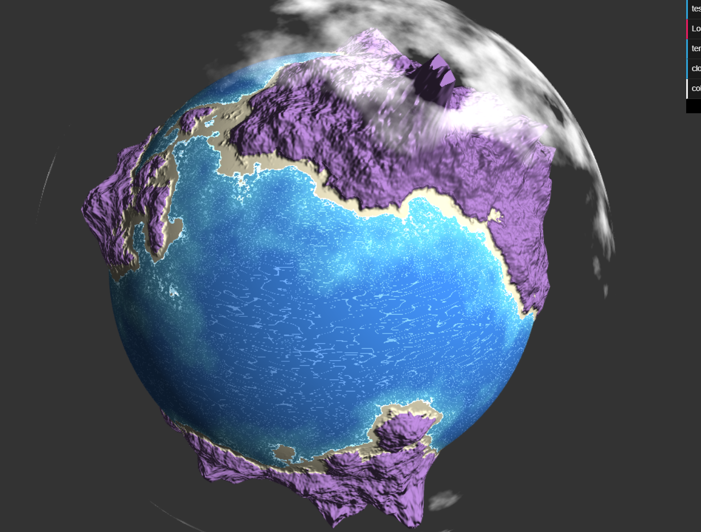

# CIS 566 Project 1: Noisy Planets

## Ruth Chung
33615194
helpful  resources:
rachel's slides, shadertoy noise (links in shaders), glsl documentation

(i promise i pushed before the deadline, it just took me a while to type up this readme ;-;)

link to demo (apologies if it is on the wrong github link):
[https://ruthchu.github.io/hw00-webgl-intro/]

# Techniques used:
TERRAIN
- used simplex noise and fbm as well as a gain function to generate mountainous terrain
- all outputs below a certain value were snapped to make a flat waterline
- coastline is made by lerping height according to a easing function (not really sure if this worked but it flattened, and joins relatively smoothly)(coloring is not so great tho)
- coloring between the coast and mountains is boundary based (did not have time to lerp nicely)

WATER
- waves move slowly over time
- used an interpolation based on a smoothstep between noise values to output the base color of the water
- used noise to define boundaries of different wave caps (two different wavecap fuctions, one for the shore, one for deep water)
- used warped simplex noise to make two different surface waves
- shore waves are only generated when the noise falls within a certain boundary of the simplex noise
- deep water wavecaps has a boundary to define when to make wavecaps that are stretched in the y direction (the larger lines) or very highly noisy wavecaps in "shallower" deep water (the twinkling areas above the lighter colored water)

CLOUDS
- move slowly over time within their boundary (didn't have time to noise the boundary)
- second sphere with transparency values based on fbm noise
- bounded the area the clouds would form in by the same simplex noise used on the the terrain
- used a custom easing function to soften the edges of the clouds at the boundary

LIGHTING
- lambertian shading

GUI FUNCTIONS
terrainFreq:
- changes the frequency at which the terrain is sampled
- adjusts frequency for all of the water as well as the terrain
cloudHeight:
- changes the height at which the clouds form
- clouds do not clip through terrain, boundaries at which clouds form changes accordingly with how high the clouds are (so you can make the height low and make it look like fog)
- possible because the boundaries at which the clouds form uses the same noise function as the terrain
color:
- didn't have time to do something cooler with this
- changes the color of the mountains

## Objective
- Continue practicing WebGL and Typescript
- Experiment with noise functions to procedurally generate the surface of a planet
- Review surface reflection models

## Base Code
You'll be using the same base code as in homework 0.

## Assignment Details
- Update the basic scene from your homework 0 implementation so that it renders
an icosphere once again. We recommend increasing the icosphere's subdivision
level to 6 so you have more vertices with which to work.
- Write a new GLSL shader program that incorporates various noise functions and
noise function permutations to offset the vertices on the surface of the icosphere and modify the color of the icosphere so that it looks like a planet with geographic
features. Your planet should have __at least four distinct "biomes"__ on its surface (they do not have to be Earth biomes). Try making formations like mountain ranges, oceans, rivers, lakes, canyons, volcanoes, ice caps, glaciers, or even forests. We recommend using 3D noise functions whenever possible so that you don't have UV distortion, though that effect may be desirable if you're trying to make the poles of your planet stand out more.
- Combined with your noise functions, use __at least four__ different functions from the Toolbox Functions slides. They should be used to either adjust your noise distribution, or animate elements on your planet's surface.
- Implement __at least two__ surface reflection model (e.g. Lambertian, Blinn-Phong,
Matcap/Lit Sphere, Raytraced Specular Reflection) besides on the planet's surface to
better distinguish the different formations (and perhaps even biomes) on the
surface of your planet. Make sure your planet has a "day" side and a "night"
side; you could even place small illuminated areas on the night side to
represent cities lit up at night.
- Add GUI elements via dat.GUI that allow the user to modify different
attributes of your planet. This can be as simple as changing the relative
location of the sun to as complex as redistributing biomes based on overall
planet temperature. You should have __at least three modifiable attributes__.
- Have fun experimenting with different features on your planet. If you want,
you can even try making multiple planets! Your score on this assignment is in
part dependent on how interesting you make your planet, so try to
experiment with as much as you can!

Here are some examples of procedural planets:
- [Pixel Planet](https://deep-fold.itch.io/pixel-planet-generator)
- [Earthlike Planet](https://www.reddit.com/r/proceduralgeneration/comments/fqk56t/animation_procedural_planet_composition/)
- [Topographic Field](https://www.shadertoy.com/view/llscW7)
- [Dan's Final Project](https://vimeo.com/216265946)

## Useful Links
- [Implicit Procedural Planet Generation](https://static1.squarespace.com/static/58a1bc3c3e00be6bfe6c228c/t/58a4d25146c3c4233fb15cc2/1487196929690/ImplicitProceduralPlanetGeneration-Report.pdf)
- [Curl Noise](https://petewerner.blogspot.com/2015/02/intro-to-curl-noise.html)
- [GPU Gems Chapter on Perlin Noise](http://developer.download.nvidia.com/books/HTML/gpugems/gpugems_ch05.html)
- [Worley Noise Implementations](https://thebookofshaders.com/12/)

## Submission
Commit and push to Github, then __make a pull request on the original Github repository__. Assignments will no longer be submitted on Canvas.

For this assignment, and for all future assignments, modify this README file
so that it contains the following information:
- Your name and PennKey
- Citation of any external resources you found helpful when implementing this
assignment.
- A link to your live github.io demo
- At least one screenshot of your planet
- An explanation of the techniques you used to generate your planet features.
Please be as detailed as you can; not only will this help you explain your work
to recruiters, but it helps us understand your project when we grade it!

## Extra Credit
Any or All of the following bonus items:
- Use a 4D noise function to modify the terrain over time, where time is the
fourth dimension that is updated each frame. A 3D function will work, too, but
the change in noise will look more "directional" than if you use 4D.
- Use music to animate aspects of your planet's terrain (e.g. mountain height,
  brightness of emissive areas, water levels, etc.)
- Create a background for your planet using a raytraced sky box that includes
things like the sun, stars, or even nebulae.
- Add a textured moon that orbits your planet
